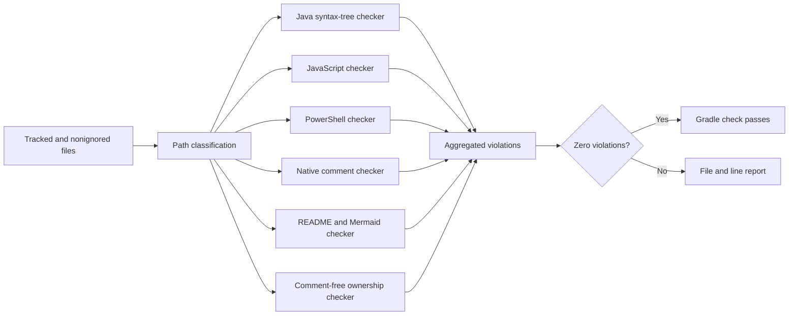
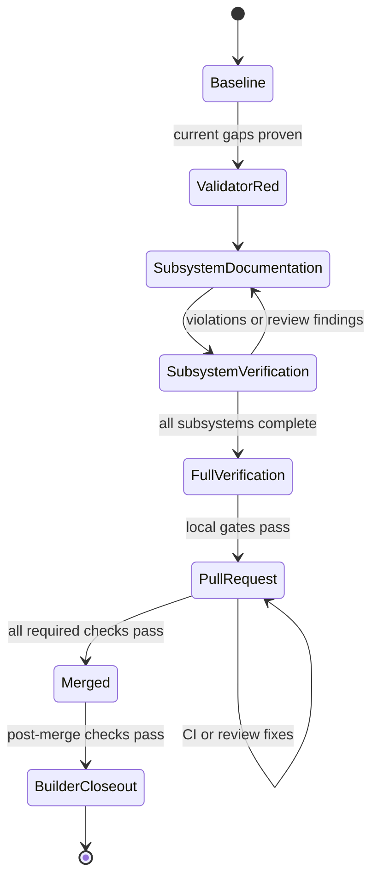

# christopherbell.dev Repository-Wide Documentation Coverage

## Document Status

Ready for execution.

## Purpose

Make the complete first-party `azurras/christopherbell.dev` codebase understandable at the file, type, callable, value, package, and system-flow levels, then prevent future documentation regressions through a tested Gradle and CI gate.

The work must document every Java type, constructor, method, private method, test method, and enum constant with accurate Javadoc; apply the language-native equivalent to JavaScript, PowerShell, build/configuration, templates, stylesheets, migrations, workflows, and other first-party text; and update every README with an accurate Mermaid state or flow diagram.

## Background

The repository is a Java 25 and Spring Boot 4.1 application with two Gradle modules, MongoDB persistence, Thymeleaf templates, vanilla JavaScript ES modules, PowerShell production tooling, and no npm workflow.

The design-time `origin/main` snapshot was `e393687d10c40b856f35d669c25bf3ea65c5c083`. It contained:

- 1,207 tracked files;
- 831 Java files;
- 97 JavaScript files;
- 21 PowerShell scripts or modules; and
- 85 README files.

None of the 85 READMEs contained a Mermaid diagram at design time. The authoritative checkout at `A:\Projects\christopherbell.dev` is heavily dirty and must not be modified. Implementation must use a new isolated worktree created from refreshed `origin/main`.

The inventory is descriptive rather than a fixed allowlist. Implementation must recompute the scope from refreshed mainline and automatically include first-party files added before completion.

## Goals

- Give every first-party file a clear, accurate purpose statement in its native documentation form.
- Give every Java declaration complete and useful Javadoc, including private and test callables.
- Give every enum constant documentation that explains its semantic meaning.
- Give non-Java callables language-native contract documentation.
- Document applicable parameters, return values, declared failures, type parameters, invariants, side effects, and ownership.
- Review and refresh every README for current purpose, ownership, important flows, and navigation.
- Add at least one accurate Mermaid state, request, data, lifecycle, or dependency-flow diagram to every README.
- Add a tested repository-owned documentation validator to Gradle `check` and all CI platforms.
- Finish with zero documentation violations, full local verification, a merged pull request, and green post-merge checks.

## Non-Goals

- Do not change application runtime behavior.
- Do not refactor production code merely to make documentation easier.
- Do not introduce a frontend framework, npm workflow, transpiler, bundler, or unrelated dependency.
- Do not edit generated artifacts, binaries, images, Gradle wrapper internals, or third-party/vendor content.
- Do not add comments that only restate an identifier, signature, or obvious syntax.
- Do not invent state machines for components that do not own state.
- Do not restart production for a documentation/build-time-only change unless verification finds a runtime-affecting change.

## Scope Boundary

### Included

All first-party tracked and newly added nonignored text/source files, including:

- Java production and test sources in `cbell-lib` and `website`;
- JavaScript production and test sources;
- PowerShell scripts, modules, and tests;
- Kotlin Gradle build scripts;
- HTML and Thymeleaf templates;
- CSS;
- YAML and properties configuration;
- XML service and workflow configuration;
- SQL migrations;
- shell and batch entry points;
- GitHub Actions workflows;
- first-party JSON and other comment-free configuration through owning-README mappings;
- Markdown documentation; and
- every README file present in the refreshed implementation scope.

### Excluded

Only explicit path/category exclusions are permitted for:

- generated build output;
- binary and image assets;
- Gradle wrapper internals and wrapper binaries;
- third-party or vendored code/content; and
- machine-generated artifacts that are not maintained as source.

Exclusions must be narrow, path-based, documented in the validator, and covered by tests. There must be no blanket suppression file for individual undocumented declarations.

## Documentation Contract

### General quality

Documentation must explain one or more of:

- purpose and ownership;
- caller-visible contract;
- valid and invalid states;
- inputs and outputs;
- invariants and preconditions;
- side effects, I/O, mutation, blocking, concurrency, or external services;
- expected failure conditions and propagated unexpected faults; or
- why a non-obvious implementation boundary exists.

Boilerplate that merely restates a name is a violation even if a comment token is present.

### Java

Every declared class, interface, record, annotation, enum, nested type, constructor, compact constructor, method, private method, and test method must have meaningful Javadoc.

Every enum constant must have its own Javadoc explaining the represented value or state.

Callable Javadocs must include, wherever applicable:

- one `@param` for every parameter;
- one `@param <T>` for every type parameter;
- `@return` for every non-`void` result;
- `@throws` for every declared checked or runtime failure that callers must understand; and
- relevant side-effect, blocking, mutation, authorization, persistence, or concurrency notes in the description.

`{@inheritDoc}` is permitted only when the inherited contract is complete and accurate for the implementation. Additional implementation-specific constraints or failures must be documented locally.

A top-level type's Javadoc satisfies the purpose requirement for a conventional one-type Java file. Every independently declared type in a multi-type file still requires its own Javadoc. Comments for Lombok- or compiler-generated methods that do not exist as source declarations are not required.

### JavaScript

Every first-party JavaScript file must start with module-purpose JSDoc. Every named function, exported function, class, constructor, method, and independently meaningful callback must have JSDoc with applicable parameter, return, asynchronous result, thrown/rejected failure, mutation, and DOM/network side-effect documentation.

Anonymous inline callbacks that are trivial control-flow expressions do not require a separate block. Callbacks with independent responsibility do.

### PowerShell

Every first-party script and module must have file-level comment-based help. Every exported and private function must document its purpose, parameters, outputs, side effects, privilege requirements, external commands/services, and failure behavior using PowerShell-native help conventions.

### Other comment-capable formats

Kotlin build scripts, HTML, CSS, YAML, properties, XML, SQL, shell/batch, workflows, and other comment-capable formats must contain a concise purpose comment in valid native syntax before the first semantic content. Independently meaningful callable/configuration units must be documented where the format supports it.

### Comment-free formats

A strict format that does not legally support comments, such as JSON, must not receive schema-breaking pseudo-comment fields. Its purpose, owner, consumers, important fields, and update constraints must be documented in the nearest owning README. The validator must require and verify an explicit mapping from that file to the owning README.

## README and Diagram Contract

Every README must be reviewed against current code rather than mechanically appended.

Each README must describe, as applicable:

- the owned package, module, resource tree, or subsystem;
- what belongs and does not belong there;
- important public interfaces, commands, routes, files, or data;
- dependencies and consumers;
- security, persistence, operational, or failure boundaries;
- testing and update expectations; and
- useful links to narrower or broader documentation.

Every README must contain at least one fenced Mermaid diagram. Use the most truthful diagram type:

- `stateDiagram-v2` for real domain or lifecycle states;
- `flowchart` for request, data, control, build, ownership, or dependency flow;
- `sequenceDiagram` when actor ordering is the important relationship; or
- another supported Mermaid form only when it expresses the owned behavior more accurately.

A diagram must use real component names and real transitions/edges. Artificial states, generic placeholder nodes, and identical copy-pasted diagrams across unrelated READMEs are unacceptable.

## Validator Architecture

Create a small, tested, repository-owned documentation validator integrated with Gradle as `documentationCheck`.

### Discovery

The validator must discover tracked and newly added nonignored files automatically. It must normalize Windows and Unix paths and classify files by language, ownership, and exclusion rule. The discovery mechanism must not depend on a manually maintained complete file inventory.

### Java analysis

Use the Java 25 JDK compiler syntax-tree and documentation APIs to parse source declarations and associate Javadocs without compiling application dependencies. Inspect types, constructors, compact constructors, methods, nested types, records, annotation members, enum constants, parameters, type parameters, return types, and declared exceptions.

Do not use regular expressions as the primary Java declaration parser.

### Non-Java analysis

Use dedicated format-aware scanners for JavaScript, PowerShell, native purpose comments, README structure, and comment-free ownership mappings. Scanners must understand strings and comments sufficiently to avoid treating comment text as declarations.

No npm workflow is introduced. The JavaScript checker is part of the repository-owned validator and must be tested against the JavaScript forms used by the repository.

### Reporting

The validator must:

- collect all violations in one run;
- print rule identifier, repository-relative path, line, and actionable message;
- print totals by language and violation category;
- fail on parser errors, unknown included text formats, missing ownership mappings, malformed documentation tags, malformed Mermaid blocks, or any undocumented required element; and
- exit successfully only with zero violations.

### Build and CI integration

- Expose `documentationCheck` through Gradle.
- Make the normal repository `check` or `build` lifecycle depend on it.
- Run the same gate on Ubuntu, macOS, and Windows through the existing matrix CI.
- Add private Javadoc generation with doclint enabled to verification.
- Keep validator unit/fixture tests in the ordinary verification lifecycle.

The validator data flow is:

## Implementation and Review Strategy

Use one isolated branch and pull request with cohesive subsystem commits:

1. Recompute inventory and capture a clean full baseline.
2. Implement validator fixtures and failing tests first.
3. Implement the minimum validator rules and prove they expose current gaps.
4. Document `cbell-lib` production and test code.
5. Document website backend packages in bounded feature groups.
6. Document first-party JavaScript and tests.
7. Document PowerShell production tooling and tests.
8. Document templates, stylesheets, build/configuration, migrations, workflows, and other first-party text.
9. Review and update all READMEs with accurate diagrams.
10. Drive `documentationCheck` to zero, run final verification, and review the complete diff for comment quality and unintended semantic changes.
11. Push a pull request, wait for every required CI and CodeQL check, address valid feedback, merge, and verify post-merge mainline checks.
12. Record Builder test, update, review, session-memory, and closure artifacts.

The delivery flow is:

## Behavior and Safety Invariants

- The authoritative dirty checkout remains untouched.
- Runtime behavior, public APIs, data formats, permissions, and persistence semantics remain unchanged.
- Documentation describes the implementation as it exists; implementation is not changed to make a comment true.
- If documentation review reveals a probable behavior defect, record it separately rather than silently changing behavior within this scope.
- Build-time validation is deterministic and does not require production services, credentials, MongoDB, network access, or external documentation services.
- CI behavior remains cross-platform.
- Newly added files cannot bypass the gate through a stale inventory.
- Comment-free formats remain schema-valid.

## Validation Plan

### Baseline

Before source edits in the isolated worktree:

- confirm clean status and refreshed `origin/main`;
- run the full Gradle build;
- record Java test counts and outcomes;
- record JavaScript test counts and outcomes;
- run applicable PowerShell/Pester suites on Windows;
- run existing syntax/configuration checks; and
- capture the initial documentation validator RED evidence after its test-first introduction.

### Focused verification

For each subsystem commit:

- run validator fixture tests;
- run `documentationCheck` for the affected scope and then globally;
- compile affected Java modules;
- run JavaScript syntax/tests for touched JavaScript;
- run Pester for touched PowerShell;
- validate Markdown fences, local links, and Mermaid structure for touched READMEs; and
- inspect the diff for semantic code changes and low-value comments.

### Final verification

Completion requires:

- zero `documentationCheck` violations;
- private Javadoc generation with doclint enabled;
- successful repository formatting/syntax checks;
- successful full Gradle build;
- successful Java and JavaScript tests;
- successful applicable PowerShell/Pester tests;
- `git diff --check`;
- a deterministic final inventory proving every included file was evaluated;
- manual review of every exclusion and comment-free ownership mapping;
- manual review of all README diagrams for truthful flows;
- no unintended runtime behavior change in the final diff;
- all pull-request CI and CodeQL checks green;
- pull request merged; and
- post-merge mainline checks green.

## Acceptance Criteria

The work is accepted only when all of the following are true:

1. Every included Java source declaration required by this specification has meaningful Javadoc and complete applicable tags.
2. Every enum constant has semantic documentation.
3. Every included JavaScript and PowerShell callable has language-native equivalent documentation.
4. Every included first-party file has purpose documentation directly or through the permitted comment-free owning-README rule.
5. Every README in the refreshed scope is current and has an accurate Mermaid flow diagram.
6. The tested validator reports zero violations and runs through Gradle and the existing CI matrix.
7. Javadoc/doclint and all repository verification pass.
8. The final diff contains no unintended runtime behavior changes.
9. The changes are merged and post-merge checks pass.
10. Builder evidence and closure artifacts are complete.

## Risks and Mitigations

- **Large review surface:** use subsystem commits, zero-behavior-change discipline, focused verification, and final diff review.
- **Shallow generated prose:** require contract-specific content and manually review each subsystem instead of bulk template insertion.
- **Parser false positives:** use syntax-tree parsing for Java, fixture-based tests for every repository-native non-Java form, and fail visibly rather than silently skipping.
- **Javadoc changes becoming stale:** enforce the same zero-violation gate on every future Gradle/CI build.
- **Diagram cargo culting:** select diagram form by real ownership and flow, and reject generic or copied diagrams.
- **Concurrent mainline drift:** create the implementation worktree only after planning, refresh `origin/main`, and recompute inventory before edits.
- **Dirty production checkout:** never edit or reset it; isolate all work in a new worktree.

## Open Questions

None. The user approved the target repository, first-party scope boundary, diagram selection rule, CI enforcement, complete Javadoc tags, language-aware approach, delivery workflow, and acceptance criteria on 2026-07-29.
