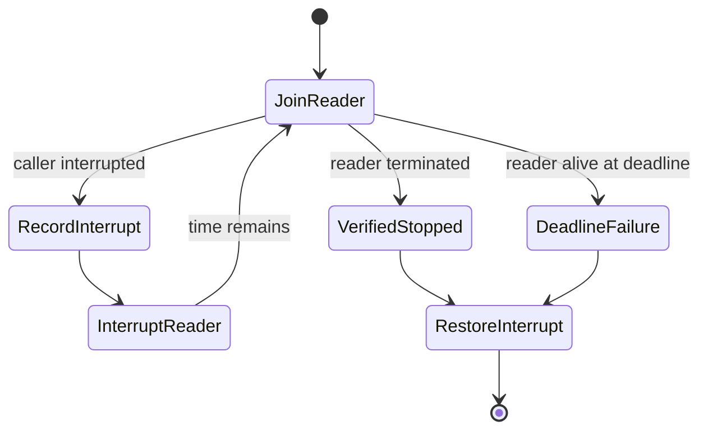

# Documentation Discovery Corrective Design

## Document Status

Ready for execution. The user approved the narrow corrective approach and the written specification on 2026-07-29.

## Purpose

Close the three residual load-bearing findings in the `christopherbell.dev` documentation-discovery foundation before Java or non-Java validators depend on it.

## Background

Phase 1 added a JDK-only `documentation-validator` Gradle module on branch `codex/repository-documentation-coverage`. Its final fix wave passed 1,543 tests with no failures or errors, but the mandatory scoped re-review retained three defects: incomplete repository-native archive exclusions, incomplete output-reader termination verification when cleanup is interrupted, and related Javadoc omissions. The branch is preserved at `e4784620bdfa072fb07415ea1d4e6fce688d0d27`; the dirty authoritative checkout at `A:\Projects\christopherbell.dev` remains out of bounds.

## Goals

- Classify `.nar`, `.ear`, and compound `.tar.gz` artifacts as named archive exclusions without hiding owned near misses.
- Guarantee that cleanup either verifies output-reader termination within a bounded deadline or reports a cleanup failure.
- Preserve every cleanup interruption, complete bounded cleanup, and restore the caller's interrupt flag afterward.
- Document null-input and cleanup failure behavior accurately on every affected callable.
- Prove the corrections with deterministic tests, complete local verification, and independent review.

## Non-Goals

- Do not add Java Javadoc validation, non-Java validation, README validation, Gradle `check` wiring, or CI wiring.
- Do not document application/library source files or update READMEs in this corrective phase.
- Do not rebase, merge, pull, push, or open a pull request until the discovery foundation is review-clean.
- Do not alter runtime application, library, operations, resource, workflow, or Gradle-wrapper files.
- Do not replace the existing process lifecycle abstraction unless the narrow correction proves infeasible.

## Requirements

### Archive classification

- Add `.nar` and `.ear` to the named `ARCHIVE_FILE` classification.
- Recognize `.tar.gz` as one case-insensitive compound suffix rather than only the final `.gz` extension.
- Preserve component-aware path handling and literal Unix backslashes.
- Test root and nested archive paths plus near misses such as `.ear.txt`, `.tar.gzip`, and filenames that merely contain the suffix text.

### Bounded reader cleanup

- Retain `GitProcessSession` as the sole owner of the Git process, streams, and reader.
- Replace the interrupted `stopReader()` early return with a monotonic-deadline loop.
- On interruption, record the interruption as the primary or suppressed cleanup failure, interrupt the reader, and continue bounded join attempts with the remaining deadline.
- If the reader remains alive when the deadline expires, report that termination was not verified.
- Restore the caller's interrupt flag only after all process, stream, and reader cleanup steps finish.
- Preserve the governing execution failure; cleanup failures remain suppressed behind it.
- Use synchronization primitives such as latches or phasers for deterministic cleanup-interruption tests. Do not use timing sleeps.

### Documentation contract

- `RepositoryDiscovery.discover(Path)` must document its null-root failure.
- `DocumentationPolicy.exclusionReason(Path)` must document its null-path failure.
- Cleanup documentation must promise bounded verified termination only after the implementation and tests establish it.
- Every new or changed type, constructor, method, private method, field, and applicable parameter/return/throws contract must have accurate Javadocs.

## Proposed Approach

Use a narrow correction rather than replacing the process abstraction.

`DocumentationPolicy` will keep named `ExclusionReason` results, expand the archive suffix inventory, and evaluate compound suffixes directly against the case-folded filename. Exact suffix matching keeps `.tar.gz` classified while leaving near misses owned.

`GitProcessSession.stopReader()` will calculate one cleanup deadline from `System.nanoTime()`. It will repeatedly join for the remaining duration, collecting any `InterruptedException`, interrupting the reader, and continuing until the reader terminates or the deadline expires. Because `InterruptedException` clears the current flag, the cleanup loop can continue; `close()` restores the accumulated interruption only after every owned resource has been handled.

The deterministic process fixture will coordinate the cleanup thread and a blocking reader with latches, interrupt cleanup only after the join begins, then release the reader. The test will assert bounded completion, restored interrupt status, terminated reader, and retained interruption context.

## Files and Modules Involved

- `documentation-validator/src/main/java/dev/christopherbell/tools/documentation/DocumentationPolicy.java`
- `documentation-validator/src/main/java/dev/christopherbell/tools/documentation/RepositoryDiscovery.java`
- `documentation-validator/src/test/java/dev/christopherbell/tools/documentation/RepositoryDiscoveryTest.java`
- `documentation-validator/src/test/java/dev/christopherbell/tools/documentation/RepositoryDiscoveryProcessTest.java`

No other spoke files should change.

## Validation Plan

- Observe focused RED failures for the missing archive classifications, interrupted cleanup verification, and Javadoc contracts where mechanically testable.
- Run the focused discovery and lifecycle tests to green.
- Run `:documentation-validator:test` and require zero failures/errors.
- Run direct private-member Javadocs and require zero warnings.
- Run the full root Gradle build with the isolated Gradle home and require zero failures/errors.
- Run `git diff --check`.
- Confirm the isolated worktree contains only the planned files and the authoritative checkout remains untouched.
- Run an independent task review followed by a whole-phase review before any later validator plan begins.

## Rollback and Recovery

Revert only the corrective commit in the isolated branch. Preserve the worktree and all prior discovery commits. Never reset, clean, or switch the authoritative checkout.

## Open Questions

None.

## Approval Record

- User authorized a new corrective phase on 2026-07-29.
- User approved the narrow `GitProcessSession` correction design on 2026-07-29.
- User approved this written specification on 2026-07-29.
