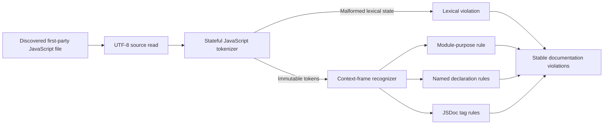

# JavaScript Documentation Scanner Design

## Document Status

Ready for execution.

## Purpose

Define a deterministic, repository-owned JavaScript documentation scanner for `azurras/christopherbell.dev` that can recognize the first-party JavaScript forms used by the application without npm, a vendored parser, declaration-matching regular expressions, or application execution.

The scanner will enforce module-purpose JSDoc and complete JSDoc for named JavaScript callables while protecting declaration recognition from strings, comments, template literals, and regular-expression literals.

## Background

The repository documentation campaign already has a corrected Git discovery boundary and a Java 25 syntax-tree Javadoc checker. At Java-checker completion commit `d4a77e2e2a58906b968f61972ea964cdc10a8833`, discovery identifies 96 first-party JavaScript files after excluding `website/src/main/resources/static/vendor/jsmediatags-3.9.7.min.js`.

The included JavaScript consists of 59 browser/resource modules and 37 Node test files. It uses ECMAScript modules, named and default exports, function declarations, nested arrow bindings, function expressions, classes, constructors, instance and async methods, object method shorthand, and arrow-valued object properties. The test lifecycle uses Node's built-in test runner through `website:jsTest`; no npm package workflow exists.

Lexical hazards are present in owned code: regex literals and character classes, URLs and comment-like text inside strings, multiline template literals, nested template interpolation, optional chaining, default/destructured parameters, and anonymous event/promise/collection callbacks.

## Goals

- Require a nonblank leading module-purpose JSDoc in every first-party `.js` file.
- Recognize every named function declaration, named function/arrow binding, class, constructor, class method, and named object callable used by the repository.
- Require directly attached, nonblank JSDoc for every recognized named declaration at every visibility or nesting depth, including test helpers.
- Parse applicable ordinary/destructured/rest/default parameters and syntactic return behavior sufficiently to validate JSDoc tags in the later recognizer phase.
- Keep comments, strings, regex bodies, and template raw text from producing false declarations.
- Preserve exact repository-relative path, source line, stable rule identifier, and actionable message for every violation.
- Fail closed on malformed or unsupported syntax rather than silently skipping possible declarations.
- Use only the Java standard library in production scanner code.

## Non-Goals

- Do not implement or claim a complete ECMAScript parser.
- Do not introduce npm, a package lockfile, a JavaScript parser dependency, a browser framework, TypeScript, JSX, or CommonJS support.
- Do not validate vendored/minified JavaScript already excluded by discovery policy.
- Do not require separate JSDoc for anonymous callback arguments passed to event, promise, collection, timer, or Node test APIs.
- Do not change application JavaScript structure merely to simplify scanner recognition.
- Do not remediate JavaScript documentation, wire Gradle/CI, or expose the final aggregate command in the lexical-foundation phase.

## Considered Approaches

### 1. Java tokenizer plus shallow structural recognizer

Selected. A Java-standard-library tokenizer separates lexical content, followed by a bounded token/context recognizer for repository-native declarations. It keeps validation in the existing Java validator process, adds no runtime dependency, and permits deterministic fail-closed errors.

The cost is careful handling of regex-versus-division and object-versus-block ambiguity. These risks are controlled by an explicit state machine, context frames, real-source fixtures, and unsupported-syntax diagnostics.

### 2. Node subprocess scanner

Rejected. Node is currently available in CI for browser tests, but making repository documentation validation depend on process startup and a second executable would complicate failure ownership, cross-platform cleanup, and local Gradle use. Node alone also does not expose a stable public AST parser without adding a package or relying on unsupported internals.

### 3. Third-party Java or JavaScript parser

Rejected. A full parser would provide wider grammar coverage, but the repository uses a bounded ESM subset and the added dependency/supply-chain surface is disproportionate. The design intentionally recognizes owned forms and fails visibly when the syntax boundary expands.

## Approved Architecture

Implementation is divided into two independently reviewed phases.

### Phase A: lexical foundation

Create a pure tokenizer that accepts JavaScript source text and returns immutable tokens plus immutable lexical errors. It performs no file discovery, JSDoc policy, or declaration validation.

Token data includes:

- token kind;
- exact source spelling where needed by the recognizer;
- one-based line and column;
- start and exclusive end offsets; and
- JSDoc content as a distinct token kind.

Ordinary whitespace is not emitted. Complete non-JSDoc comments are retained as exact-position attachment-barrier tokens: the recognizer never interprets their contents as code, but it must be able to distinguish whitespace-only separation from an intervening ordinary comment without rereading source. An explicit end-of-file token closes a successful stream. Invalid source returns exactly one lexical error at the first position that makes recovery unsafe; tokens emitted before that error may remain in the immutable result for diagnostics, but the recognizer must reject the result and consume none of them.

### Phase B: structural recognizer and documentation rules

Consume lexer tokens with explicit delimiter and syntactic-context frames. Recognize only forms demonstrated by repository source or required by the approved campaign contract. The recognizer never re-reads source with declaration regular expressions.

Recognized declarations are routed into the existing `DocumentationViolation` boundary and sorted by display path, line, rule, and message with Java findings later at the aggregate layer.

The data flow is:

## Lexical State Model

The tokenizer owns these explicit states:

- `CODE`: identifiers, keywords, numbers, delimiters, operators, and punctuators;
- `LINE_COMMENT`: text from `//` through the line terminator;
- `BLOCK_COMMENT`: ordinary `/* ... */` content;
- `JSDOC`: `/** ... */` content retained for attachment and tag parsing;
- `SINGLE_QUOTE`: single-quoted string with escapes and line-continuation rules;
- `DOUBLE_QUOTE`: double-quoted string with escapes and line-continuation rules;
- `TEMPLATE_RAW`: raw template content where code-looking text is inert;
- `TEMPLATE_EXPRESSION`: ordinary code inside `${...}`, with a brace-depth owner and support for nested templates;
- `REGEX`: regular-expression body with escapes;
- `REGEX_CHARACTER_CLASS`: bracketed regex content where `/` does not terminate the literal.

Line terminators are normalized for position accounting without changing token spelling. Unterminated comments, strings, templates, interpolations, regexes, or character classes are lexical errors. Unmatched closing delimiters and unterminated opening delimiters are recognizer errors because delimiter meaning depends on token context.

## Regex and Template Decisions

`/` is classified in this order:

1. `//` begins a line comment.
2. `/*` begins a block comment or JSDoc.
3. Otherwise, `/` begins a regex only where the previous significant token permits an expression start, including after opening delimiters, separators, assignment/operators, and expression-leading keywords such as `return`, `throw`, `case`, `yield`, and `await`.
4. In proven value-ending contexts—identifier, literal, closing bracket, a value-parenthesis closure, or postfix increment/decrement—`/` is division or a division-assignment punctuator.
5. A slash immediately after an ordinary closing brace is lexically ambiguous until the structural layer proves object-versus-block ownership. Phase A therefore fails closed at that slash instead of guessing; Phase B may later supply proved brace context and broaden the classification with fixtures.

Regex flags are consumed as identifier-part characters after the closing slash. Fixtures must include division chains, regex character classes containing slash-like punctuation, escaped slashes, ambiguous post-brace failure, and repository-native regexes.

Template raw text is inert. `${` transitions into ordinary tokenization with a dedicated interpolation brace owner. Closing the interpolation returns to template raw state; nested object literals, blocks, templates, strings, comments, and regexes inside interpolation must preserve the correct owner.

## Structural Recognition Policy

The recognizer maintains delimiter frames for parentheses, brackets, ordinary blocks, class bodies, object literals, and template expressions. It recognizes:

- plain, exported, default-exported, async, and generator function declarations;
- named `const`, `let`, or `var` bindings whose value is an arrow or function expression;
- named returned function expressions only when the function expression itself has a source name;
- class declarations at module or nested scope;
- constructors and named class methods, including async, static, accessor, private, and generator syntax even when a form is not currently common;
- object shorthand methods; and
- named object properties whose value is an arrow or function expression.

Default-exported anonymous functions/classes are recognized with a stable identity derived from `default export` and require JSDoc. Anonymous class expressions not bound to a stable identifier are outside the named-declaration rule, but their named members are still traversed.

Object-versus-block ambiguity is resolved from surrounding token context. If context cannot determine whether a callable-looking sequence is a declaration, the scanner emits an unsupported-syntax violation rather than guessing.

## JSDoc Attachment and Contract Policy

A JSDoc attaches only to the next eligible module or declaration token across whitespace. An ordinary-comment barrier token, semantic token, or completed declaration breaks attachment. One JSDoc cannot satisfy two declarations.

Required documentation:

- the first semantic content of every file must be a nonblank module-purpose JSDoc; imports and directives may follow it;
- every recognized class and named callable requires directly attached, nonblank JSDoc;
- applicable parameters require documented `@param` entries;
- functions with a syntactic value return or concise arrow expression require `@return` or `@returns`;
- declared or syntactically thrown caller-visible failures require `@throws` when the recognizer can establish the contract; and
- async behavior, mutation, DOM/network/storage effects, cancellation, and ownership remain semantic review requirements during remediation.

Tag parsing is structural and conservative. Destructured parameters are validated by position and documented binding/property coverage defined in the recognizer plan; implementation must not invent a source parameter name. Rest and default wrappers do not change the underlying parameter identity.

## Callback Policy

Named local bindings and named object properties that contain arrows or function expressions are independently documentable callables and require JSDoc.

Anonymous functions/arrows used directly as arguments to event, promise, collection, timer, observer, or Node test APIs do not require separate JSDoc. Their behavior must be described by the enclosing named callable or by the test's literal case name. This avoids unnatural inline JSDoc placement while preserving documentation ownership.

If an anonymous callback is assigned, returned with a source name, stored as a named property, or otherwise gains a stable code identity, the corresponding named declaration rule applies.

## Failure and Safety Behavior

- File reads are UTF-8 and I/O failures preserve the `RepositoryFile` path and causal exception.
- Malformed lexical states and unmatched delimiters become deterministic violations, never silent skips.
- Unsupported grammar becomes a stable unsupported-syntax violation at the first uncertain token.
- The scanner performs no code execution, DOM access, Node invocation, network access, dependency resolution, or application import.
- All outputs are immutable and deterministic.
- The authoritative dirty checkout remains untouched; all implementation occurs in the existing isolated campaign worktree.

## Expected Modules

The lexical foundation is expected to add focused package-private types under:

`documentation-validator/src/main/java/dev/christopherbell/tools/documentation/`

Likely responsibilities are:

- a token kind enum;
- a validated token record;
- a validated lexical-error record;
- an immutable lexical result; and
- one stateless tokenizer.

Names and exact APIs must be fixed in the implementation plan after repository and JDK convention review. The later recognizer should consume these types directly rather than exposing a public parser framework.

## Validation Plan

### Lexical foundation fixtures

- identifiers, keywords, Unicode identifiers, private names, numeric forms, and multi-character punctuators;
- line, block, and JSDoc comments with correct attachment-relevant token retention;
- equal-width whitespace and ordinary-comment gaps after JSDoc, proving that only the comment gap breaks attachment;
- contextual IdentifierName division versus proved `for ... of` expression-leading use;
- ECMAScript identifier boundaries around U+FEFF, unsupported controls, joiners, and supplementary code points;
- strict-module numeric string/template escape acceptance and rejection, including standalone `\\0` and prohibited decimal escapes;
- comment markers and URLs inside single/double strings;
- escapes, line continuations, and unterminated strings;
- regex literals, escaped slashes, character classes, flags, division, and division assignment;
- multiline templates, nested `${...}`, nested braces/objects/templates, comments, strings, and regexes inside interpolation;
- line/column/offset accuracy across CRLF, LF, and Unicode;
- malformed/unclosed states and unmatched lexical interpolation ownership; and
- immutable tokens/errors with deterministic ordering.

### Recognizer fixtures

- leading module-purpose JSDoc acceptance and missing/empty/ordinary-comment failures;
- imports plus named/default/multiline export modifiers;
- plain/exported/async/generator functions;
- named function expressions and arrows at module and nested scope;
- destructured/default/rest/single parameters and concise/block arrow bodies;
- classes, constructors, async/static/accessor/private/generator methods, and nested classes;
- object shorthand methods and arrow/function-valued properties in nested objects;
- named callback enforcement and anonymous argument callback exemption;
- direct JSDoc attachment and single-use ownership;
- malformed tags, missing params/returns/throws, and nonblank descriptions;
- unsupported syntax and unmatched delimiters; and
- exact rule/path/line/message identity without duplicate traversal.

### Phase verification

Each phase uses test-first RED/GREEN evidence, complete validator tests, direct private Javadocs, root build, `git diff --check`, authoritative-checkout status hashing, task review, and final whole-phase review.

## Acceptance Criteria

- The tokenizer protects declaration recognition from every demonstrated repository lexical hazard.
- The recognizer covers all repository-native named declaration forms and the approved callback boundary.
- Module, declaration, and applicable tag violations are exact, deterministic, and actionable.
- Malformed or unsupported syntax fails visibly.
- No npm workflow, parser dependency, JavaScript execution, or source-declaration regex is introduced.
- Validator, JavaScript, and root build tests remain green.
- Independent review finds no remaining Critical or Important issue.

## Open Questions

None. The user selected the Java-standard-library tokenizer plus shallow recognizer approach and approved this written design on 2026-07-29. Exact lexical APIs and task boundaries are fixed by independently reviewed implementation plans before each phase executes.
