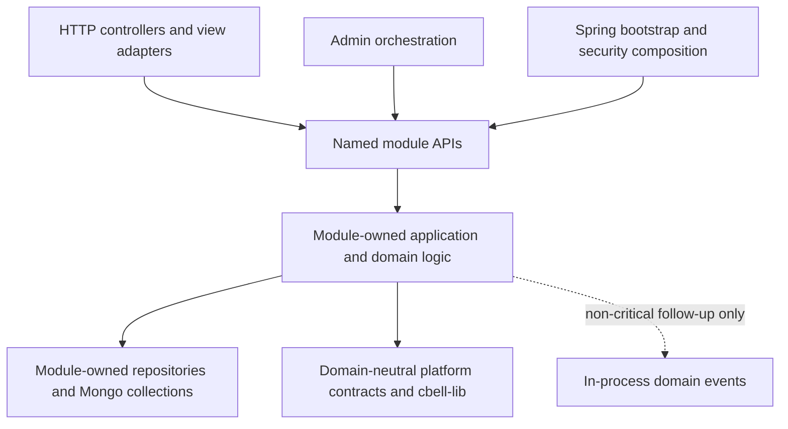

# christopherbell.dev Modular Monolith

## Document Status

ready-for-review

## Purpose

Turn the `christopherbell.dev` Spring Boot application into an explicitly modular monolith: one deployable application whose backend business capabilities have small public APIs, private implementations, acyclic dependencies, and CI-enforced ownership boundaries.

## Background

The authoritative spoke is `A:\Projects\christopherbell.dev`, with remote `https://github.com/azurras/christopherbell.dev.git`. This design was derived from remote `main` commit `9c587103cb7f7df2ab52ed3e232f1ca67660fd6e`, which matched the local `origin/main` reference on 2026-08-04. The authoritative checkout itself is intentionally not a planning surface because it is three commits ahead, 120 commits behind, and contains extensive unrelated user changes.

The repository already produces one Spring Boot application from the `website` Gradle subproject and one domain-neutral support library from `cbell-lib`. The application contains 626 Java files across 18 top-level packages. A static import inventory found 449 cross-package imports spanning 71 distinct dependency directions. Existing packages often express recognizable capabilities, but no automated architecture rule prevents a consumer from importing another capability's repositories, persistence documents, implementation services, or internal DTOs.

The migration must strengthen backend boundaries without changing the single-process deployment model, reorganizing browser assets, pausing feature delivery for a big-bang refactor, or prematurely designing independently deployed services.

## Goals

1. Preserve one `website` boot JAR, one process, and the current production deployment topology.
2. Define backend modules by business capability rather than by technical layer.
3. Give every module an intentionally small published API and keep its repositories, persistence documents, implementation services, and internal DTOs private.
4. Make module dependencies explicit, acyclic, and continuously enforced in CI.
5. Migrate incrementally while ordinary feature delivery continues.
6. Preserve public HTTP contracts, MongoDB collection names, and persisted document shapes during boundary extraction.
7. Keep runtime behavior, security, logging, readiness, and operational verification at least as strong as they are today.

## Non-Goals

- Do not split the application into microservices or independently deployed processes.
- Do not create one Gradle subproject per business capability.
- Do not reorganize templates, JavaScript, CSS, or other frontend assets as part of this migration.
- Do not add a message broker, transactional outbox, durable Spring Modulith event registry, Modulith actuator endpoint, or runtime module verifier.
- Do not redesign public APIs, routes, authentication, authorization, MongoDB schemas, or production operations merely to create package boundaries.
- Do not move feature-specific code into `cbell-lib` unless at least two real consumers require the same domain-neutral behavior.
- Do not retain a permanent exception list for legacy coupling; the baseline must reach zero and be deleted.

## Requirements

### Deployment and build shape

- `settings.gradle.kts` must continue to include `website` and `cbell-lib`.
- `website` must remain the only Spring Boot deployable.
- `cbell-lib` must remain unable to depend on `website`.
- Spring Modulith must be used for build/test-time module discovery, verification, focused integration testing, and optional generated architecture documentation only.
- Spring Modulith 2.1 is the selected compatibility line for Spring Boot 4.1. The exact dependency version must be pinned through its BOM and verified against the repository's resolved dependency graph before implementation.

### Module model

The target business modules are:

| Target module | Current package ownership | Boundary intent |
| --- | --- | --- |
| account | `account`, plus `permission` | Identity lifecycle, authentication-adjacent account state, roles, permissions, and authorization queries. |
| admin | `admin` | Administrative orchestration and host-facing administration. No business module may depend on it. |
| blog | `blog` | Blog content and publishing behavior. |
| canesboxtracker | `canesboxtracker` | Canes price collection and review behavior. |
| federation | `federation` | Federation identity, consent, discovery, inbound, and outbound behavior. |
| location | `location` | Location and ZIP-coordinate capabilities. |
| message | `message` | Conversations, direct messages, and delivery behavior. |
| music | `music` | Catalog, library, metadata, playback, radio, security, and music web endpoints. |
| notification | `notification` | Notification delivery, inbox, and preferences. |
| photo | `photo` | Photo persistence and delivery behavior. |
| post | `post` | Post creation, editing, feeds, threads, interactions, abuse controls, and expiration. |
| report | `report` | Report submission, querying, and moderation. |
| sharedfolder | `sharedfolder` | Shared-folder access, filesystem, upload, media, maintenance, recycle, audit, and web behavior. |
| vehicle | `vehicle` | Vehicle CRUD, VIN decoding, enrichment, and generated VIN behavior. |
| whatsforlunch | `whatsforlunch` | Restaurant data and collaborative lunch workflows. |

The `permission` package must be absorbed into an account-owned authorization package because current account-to-permission and permission-to-account imports form a conceptual ownership cycle.

The current `configuration` package must be decomposed by ownership:

- Feature-specific properties, adapters, and wiring move under their owning business module.
- Truly cross-cutting, domain-neutral primitives may move to a small platform package or `cbell-lib` only when their multi-consumer use is demonstrated.
- Spring application bootstrap, security composition, global filters, Mongo migration ordering, and deployment-facing configuration remain in a thin bootstrap shell.
- Business modules may depend on published platform contracts but never on bootstrap implementation classes.

The current `view` package remains an inbound adapter layer. It may depend on published module APIs; business modules may not depend on `view`.

### Public and private surfaces

- Every migrated business module must be explicitly declared with Spring Modulith's `@ApplicationModule` metadata.
- Module detection must use `explicitly-annotated` during incremental migration so an unmigrated legacy package is not falsely presented as closed.
- Every closed module must declare its exact `allowedDependencies`.
- Cross-module access must target named interfaces such as `module::api`, not an unrestricted module root.
- A module API may publish commands, queries, stable identifiers, result DTOs, narrowly scoped semantic exceptions, and domain events.
- Repositories, Mongo documents, internal DTOs, mapping components, and implementation services must not be named interfaces.
- Existing controller- and service-facing facades may temporarily adapt to a new module API, but compatibility adapters must have an explicit removal point after their last consumer migrates.

### Dependency direction

- The module graph must be acyclic.
- `view`, `admin`, and the bootstrap shell may orchestrate published business-module APIs.
- Business modules must not depend on `view`, `admin`, or bootstrap implementation packages.
- A module must not query or mutate another module's Mongo collection directly.
- A module must not import another module's repository, persistence document, or implementation service.
- Cross-module request-path work that needs an immediate answer must use a synchronous published command or query.
- In-process domain events may be used only for follow-up behavior whose loss cannot make authoritative state incorrect.
- No new abstraction may be promoted to `cbell-lib` without at least two proven consumers and a domain-neutral contract.

### Data and failure ownership

- Every MongoDB collection must have one owning module.
- Boundary extraction must preserve existing collection names, indexes, and document shapes.
- A persistent schema change requires a separate approved migration with explicit compatibility and rollback behavior.
- Each module must expose only failures a caller needs to distinguish.
- HTTP adapters must continue mapping failures to the existing HTTP statuses and API envelopes.
- Infrastructure failures must retain their causal chains for diagnostics, must not leak internal details through public module APIs, and must not be logged redundantly at multiple layers.

### Incremental enforcement

- The first delivery slice must establish a checked-in dependency baseline from current `origin/main`.
- ArchUnit must reject any new dependency direction and any increase in the count of an existing legacy violation.
- The baseline must be deterministic, reviewable, regenerated only by an explicit command, and reduced in the same commit that removes a violation.
- Once a capability is annotated as a closed module, `ApplicationModules.verify()` and its exact allowed-dependency declarations become authoritative for that capability.
- The final migration slice must delete the legacy baseline and make zero undeclared cross-module access the permanent rule.

## Proposed Architecture

An inbound controller or view adapter translates HTTP input into a published module command or query. The owning module performs validation, authorization relevant to its data, domain behavior, and persistence, then returns a published result. Other modules use the same public boundary. Internal entities and repositories never cross the module edge.

Spring Modulith supplies the module model and standard verification: cycles are rejected, access to another module's internals is rejected, and optional explicit dependency declarations are enforced. Focused ArchUnit rules add repository-specific directionality and the temporary no-regression baseline.

## Migration Strategy

### Phase 1 - Architecture harness

- Add the Spring Modulith 2.1 BOM and test dependencies without runtime support.
- Configure explicitly annotated module detection.
- Add the central `ApplicationModules.verify()` test.
- Add ArchUnit directionality rules and the deterministic legacy baseline.
- Generate a module inventory/diagram as build output so reviewers can compare the declared graph with the code.

### Phase 2 - Account and authorization seam

- Characterize current account, security, session, role, and permission behavior.
- Define the account module's first named API.
- Move permission ownership into account authorization.
- Replace direct account repository/entity access in security and early consumers with published queries and commands.
- Close the account module and reduce the baseline.

### Phase 3 - Bootstrap and configuration seam

- Classify each configuration type as feature-owned, domain-neutral platform, or bootstrap-only.
- Move feature-owned properties and wiring to the owning module.
- Give security and Mongo bootstrap code only the published module APIs it needs.
- Enforce that business modules cannot depend on bootstrap implementation classes.

### Phase 4 - Lower-coupled capabilities

Migrate blog, location, Canes tracker, vehicle, and What's for Lunch one capability at a time. Each capability becomes a closed module before the next capability begins.

### Phase 5 - Social core

Migrate post, message, notification, report, and federation in dependency order. Replace direct entity/repository access with published APIs. Use in-process events only for non-critical notification or activity side effects that already tolerate eventual consistency.

### Phase 6 - Host-heavy capabilities

Migrate music, shared folder, and admin after the platform and identity seams are stable. Preserve their filesystem, process, lease, sensor, and Windows service boundaries and their existing production verification.

### Phase 7 - Close the graph

- Migrate photo and any remaining package ownership.
- Remove obsolete compatibility facades.
- Make every business module explicitly declared and closed.
- Delete the legacy dependency baseline.
- Require zero cycles, zero internal-package access, and zero undeclared dependencies.
- Publish the final generated module graph and module ownership documentation.

## Per-Module Delivery Slice

Every module migration must use this sequence:

1. Add characterization tests for its current public behavior and important failures.
2. Define the smallest public commands, queries, identifiers, results, failures, and optional events.
3. Add compatibility adapters behind existing controller/service facades.
4. Reroute one consumer at a time away from internal types.
5. Move repositories, persistence documents, implementation services, and internal DTOs behind the boundary.
6. Declare exact allowed dependencies and named interfaces, then close the module.
7. Reduce the checked-in legacy baseline.
8. Run focused tests, module integration tests, the architecture suite, and the full repository checks.
9. When runtime wiring or observable behavior can change, verify the packaged candidate from an isolated worktree on a non-8080 port before merge.

Each slice must be independently reviewable, releasable, and reversible. It must not combine unrelated product changes with boundary work.

## Files and Modules Involved

- `settings.gradle.kts`: preserve the two-project build shape.
- `website/build.gradle.kts`: Spring Modulith BOM/test dependencies and architecture verification integration.
- `website/src/main/java/dev/christopherbell/Application.java`: Modulith system metadata only if required by the selected configuration.
- `website/src/main/java/dev/christopherbell/*/package-info.java`: explicit module metadata and allowed dependencies.
- `website/src/main/java/dev/christopherbell/*/api/**`: named module interfaces and published types.
- `website/src/main/java/dev/christopherbell/configuration/**`: bootstrap/platform/feature ownership decomposition.
- `website/src/main/java/dev/christopherbell/view/**`: inbound adapter dependency cleanup.
- `website/src/test/java/dev/christopherbell/architecture/**`: Modulith verification, ArchUnit rules, baseline, and documentation generation.
- Existing module test packages: characterization, contract, and focused module integration coverage.
- Module README files: ownership, public API, dependencies, collection ownership, and operational notes.

Exact files and line ranges belong in the implementation plan and must be derived from a clean isolated worktree created from refreshed `origin/main`. The dirty authoritative checkout must remain untouched.

## Validation Plan

### Architecture verification

- Run a central test that constructs `ApplicationModules` from `Application.class` and calls `verify()`.
- Prove the test fails for a fixture with a cycle, an internal-package import, and an undeclared dependency.
- Prove ArchUnit fails for domain-to-view, domain-to-admin, domain-to-bootstrap, and cross-module repository/entity imports.
- Prove the legacy ratchet rejects a new dependency direction and a count increase.
- Compare generated module documentation with declared metadata in review.

### Module verification

- Add API contract/unit tests for every published command and query.
- Add a focused module integration test for every closed module, using only direct dependencies or mocks of published external APIs.
- Keep consumer regression tests when rerouting calls.
- Preserve all existing Java, JavaScript, PowerShell, packaged-JAR, security, and operations checks applicable to touched code.

### Local runtime verification

- Use a clean isolated worktree refreshed from `origin/main` and a private `GRADLE_USER_HOME`.
- Build the packaged application and start it on a non-8080 port against disposable test data.
- Exercise affected routes with exact request or UI input and record response status/body or visible UI state.
- Verify readiness/liveness, security headers, database state, expected assets, logs, and service isolation.
- Do not touch production port 8080 during candidate validation.

### Publication and production

- Deliver each slice through a focused PR with required CI and CodeQL checks.
- Merge only independently deployable slices.
- Deploy through the protected native Windows path after merge.
- Wait through listener rotation, tolerate only a transient readiness `503`, and recheck readiness/liveness and exact affected behavior.

## Rollback and Recovery

Early and middle slices preserve HTTP and MongoDB contracts, so rollback is normally an application-code rollback to the prior release. Compatibility facades remain until their final consumer migrates. A slice must not remove an old facade and introduce its replacement across multiple releases unless both versions can coexist safely.

Any future change to stored data requires a separate reversible migration plan. In-process events must not become authoritative state-transfer mechanisms, so their rollback does not require event-log recovery.

## Risks

- **False modularity:** Renaming packages without reducing access would preserve coupling. Mitigation: require named APIs, closed-module verification, and consumer-level regression tests.
- **Baseline permanence:** A broad allowlist could normalize debt. Mitigation: store exact deterministic violations, reject growth, reduce it with every migrated slice, and make baseline deletion an acceptance criterion.
- **Oversized public APIs:** Moving many entities into `api` would expose persistence by another name. Mitigation: publish use-case-specific commands, queries, IDs, and results; reject repositories and Mongo documents at the boundary.
- **Bootstrap becoming a service locator:** Central wiring could retain business behavior. Mitigation: bootstrap composes modules but does not own feature decisions or data.
- **Event misuse without durability:** In-memory events can be lost. Mitigation: use them only for non-critical follow-up; keep correctness-critical work synchronous.
- **Migration collisions with feature work:** Long-lived restructuring branches would drift. Mitigation: one capability per short-lived slice, refreshed isolated worktrees, stable compatibility facades, and independently deployable commits.
- **Dirty authoritative checkout:** Planning or implementation there could overwrite unrelated user work. Mitigation: inspect and implement only from clean sibling worktrees based on refreshed `origin/main`.
- **Framework compatibility drift:** Spring Boot or Modulith versions may change during the migration. Mitigation: pin the BOM per slice, verify the resolved graph, and keep the architecture rules expressed through tests rather than runtime coupling.

## Acceptance Criteria

- The application still ships as one `website` boot JAR and runs as one production service.
- All target business capabilities are explicitly declared closed modules.
- Every cross-module compile-time reference targets a declared named interface.
- The module graph has no cycles and no undeclared dependencies.
- No module imports another module's repository, persistence document, implementation service, or internal DTO.
- Business modules do not depend on `view`, `admin`, or bootstrap implementation packages.
- Every MongoDB collection has one documented owning module.
- The legacy dependency baseline is deleted.
- Module API, focused integration, architecture, full repository, alternate-port runtime, CI, CodeQL, and production checks pass for the final slice.
- Public HTTP behavior, MongoDB compatibility, security behavior, and the native Windows deployment topology remain intact.

## References

- [Spring Modulith overview](https://docs.spring.io/spring-modulith/reference/index.html)
- [Spring Modulith module verification](https://docs.spring.io/spring-modulith/reference/verification.html)
- [Spring Modulith fundamentals and explicitly annotated detection](https://docs.spring.io/spring-modulith/reference/fundamentals.html)
- [Spring Modulith module integration testing](https://docs.spring.io/spring-modulith/reference/testing.html)

## Open Questions

None. The user approved the target architecture, incremental enforcement strategy, backend-only scope, data ownership, failure behavior, verification, rollout, and completion rules on 2026-08-04.
