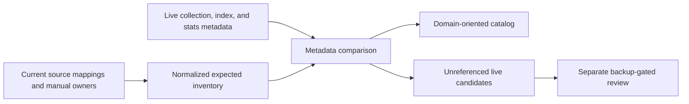

# christopherbell.dev MongoDB Collection Catalog

## Document Status

ready-for-review

## Purpose

Make the website's MongoDB data model easier to understand and maintain without merging collections whose separate ownership, indexes, retention, or access patterns protect correctness.

The work will inventory and catalog every collection referenced by current source, compare that catalog with metadata from the live production database, and identify genuinely unreferenced live collections for a separate backup-gated cleanup decision. It will not rename, merge, drop, compact, or repair a production collection.

## Background

Production currently runs one native Windows MongoDB 8.3 service bound to `127.0.0.1:27017`, one native `ChristopherBellDev` service on port `8080`, and one `christopherbell` database. The website service depends on the MongoDB service. The production runtime is not using Docker. Remote `origin/main` at `2f025762` contains one optional local-development Compose service with one named MongoDB volume.

The many items visible inside MongoDB are collections within the same database, not separate containers or server processes. They already share the MongoDB process, connection pool, storage engine, backup boundary, and host resources. Reducing collection count therefore offers negligible resource savings by itself.

A source scan of current `origin/main` found 52 Spring Data `@Document` mappings. Two vehicle import-state types intentionally map to the same `vehicle_import_state` collection, leaving approximately 51 explicitly mapped collection names before accounting for collections referenced only through `MongoTemplate` or other manual stores. These mappings span entities, social edges, security state, jobs, caches, audit events, history, preferences, leases, import checkpoints, and singleton runtime state with materially different lifecycle and index requirements.

The authoritative checkout at `A:\Projects\christopherbell.dev` has extensive unrelated user changes and is three commits ahead and 121 commits behind its local `origin/main`. It must not be used as an implementation surface. Any later spoke work must begin in a clean isolated worktree from refreshed `origin/main`.

## Decision

Preserve active physical collection boundaries. Improve model clarity through a canonical, domain-oriented catalog, naming rules for future collections, and automated catalog coverage. Treat unreferenced live collections as review candidates, never automatic deletion targets.

Do not rename awkward but active legacy collections during this work. For example, `whatsforlunch_ratings` now stores votes, but a physical rename creates migration and rollback risk without improving runtime behavior. The catalog will provide a clear logical name and mark the physical name as legacy.

## Alternatives Considered

### Broad typed buckets

Combining state, preferences, edges, jobs, and events into generic polymorphic collections would reduce the visible count most. It was rejected because it obscures bounded-context ownership, mixes index and retention requirements, increases repository and discriminator complexity, and makes unrelated data share collection-level operational behavior.

### Conservative same-domain merging

Merging only a few low-index, same-domain collections could remove a handful of names. For example, Music queue and radio singleton records could share one typed collection after resolving their colliding `global` identifiers. It was not selected because the migration and repository complexity would outweigh the limited clarity benefit. This option may be reconsidered only when a measured operational or correctness problem justifies a specific pair.

### Catalog and naming policy

Keeping intentional boundaries while documenting purpose, owner, lifecycle, and indexes provides the cleanest model with the least production risk. It also exposes stale or orphaned physical collections, which is the only likely source of count reduction without compromising active data design. This is the selected approach.

## Goals

1. Give every source-referenced MongoDB collection one documented owner and purpose.
2. Group physical collections into clear website bounded contexts without changing runtime storage.
3. Record lifecycle, retention, cardinality, sensitivity, and key index expectations for each collection.
4. Detect new undocumented collection mappings in automated verification.
5. Compare source expectations with metadata-only live inventory.
6. Identify live collections absent from current source as orphan candidates for separate review.
7. Establish consistent names for future collections while preserving active legacy names.

## Non-Goals

- Do not merge, rename, drop, compact, repair, or rewrite MongoDB collections.
- Do not read or export document bodies during inventory.
- Do not expose MongoDB metadata publicly or add an admin user interface.
- Do not move production back to Docker or change the native Windows service topology.
- Do not promise a lower collection count when the live inventory contains no proven orphans.
- Do not combine collection-catalog work with modular-monolith package restructuring or unrelated product changes.
- Do not approve future deletion merely because a collection is empty.

## Catalog Requirements

The website repository will contain one human-readable MongoDB collection catalog. Each catalog entry must include:

- physical collection name;
- logical display name when the physical name is historical or ambiguous;
- owning bounded context and package;
- mapped document type or manual `MongoTemplate` owner;
- role: entity, edge, event/history, job, cache, audit, preference, lease, or singleton state;
- expected cardinality;
- retention, TTL, and deletion behavior;
- important unique and query indexes;
- sensitivity classification;
- status: `active`, `legacy-named`, `orphan-candidate`, or `system-managed`.

The initial logical groups are account and security, social/content, messaging and notifications, federation, Music, shared folder, vehicle and location, What's For Lunch, Canes tracker, and platform operations. Group names organize the catalog; they do not create shared physical collections.

The catalog must explicitly record intentional shared mappings, including the vehicle import-state types that use `vehicle_import_state`. A shared mapping is valid only when its owning domain and identifier scheme prevent collisions and its repository behavior is proven safe.

## Naming Policy

New physical names must:

- use lowercase `snake_case`;
- identify their owning domain when the unprefixed name would be ambiguous;
- use plural nouns for entity, edge, job, event, history, and audit collections;
- use `_state` for singleton or checkpoint documents;
- use lifecycle-signaling suffixes such as `_jobs`, `_history`, `_audit`, `_cache`, `_guards`, and `_leases` when applicable;
- avoid a name based only on a Java implementation class;
- document any intentionally shared mapping and collision-proof identifier scheme.

Existing active collections that violate the convention remain unchanged and are marked `legacy-named`. A rename requires its own approved migration design, backup, compatibility strategy, rollback, and production verification.

## Source Inventory and Enforcement

A focused architecture test will fail when a source-referenced collection lacks a catalog entry. The inventory must cover:

- Spring Data mapping metadata for `@Document` types;
- collection constants used by reusable persistence components;
- literal and computed names used by manual `MongoTemplate` stores and migrations;
- intentional multiple document mappings to one physical collection.

The test must not force feature modules or persistence documents to depend on one global collection-name class. Domain ownership remains local. Manual collection owners may be enumerated explicitly where runtime mapping metadata cannot discover them reliably.

Verification must reject duplicate catalog entries, unknown status or role values, missing owners, and undocumented shared mappings. Missing live collections are not failures when a feature has never persisted data; the source catalog remains authoritative for expected ownership.

## Live Metadata Inventory

The production inventory is read-only and local to the production host. It will collect only:

- collection names;
- collection type and options;
- document counts;
- storage and index sizes;
- index names and definitions.

It must not collect document bodies, sampled field values, credentials, connection strings containing secrets, or unrestricted server diagnostics. The output must redact any unexpected sensitive values before it is preserved.

The comparison flow is:

If the production connection, source scan, metadata query, or normalization is incomplete, the inventory must fail closed and report itself as incomplete. No orphan conclusion may be drawn from partial evidence.

## Orphan-Candidate Rules

A live collection may be labeled `orphan-candidate` only when it is:

1. absent from current document mappings, manual collection constants, repositories, migrations, and operational scripts;
2. not a MongoDB system collection;
3. understood well enough to name its former owner and purpose;
4. inventoried with count, size, options, and indexes.

An orphan candidate remains untouched by this project. Empty does not mean disposable, and an old migration reference may be a compatibility or recovery requirement.

Any later removal proposal must additionally provide:

- a current compressed database archive;
- a recorded SHA-256 for the archive;
- successful restore parsing or dry-run validation;
- an exact-namespace backup for the candidate;
- an impact report and explicit user approval;
- one-at-a-time removal and a retained rollback archive;
- Mongo-backed application and production health verification after removal.

## Failure Handling

- Source discovery failure: fail the catalog test and identify the undiscovered owner or mapping form.
- Production metadata access failure: preserve the source catalog, mark the live comparison incomplete, and make no cleanup recommendation.
- Source-only collection: classify it as expected but not yet materialized unless runtime evidence proves a configuration error.
- Live-only collection: classify it as an unreviewed extra until ownership and history are established.
- Conflicting owners: treat the conflict as a design defect; do not resolve it by placing both types into a generic bucket.
- Unexpected sensitive metadata: stop report generation, redact the value, and narrow the query before retrying.

## Expected Files and Ownership

Later implementation is expected to involve:

- a website architecture or operations Markdown catalog under `docs/`;
- focused Java architecture tests under `website/src/test/java/dev/christopherbell/architecture/` or the repository's current equivalent;
- a bounded metadata-only inventory command or script under the existing native Windows operations boundary if one does not already exist;
- Builder test-report, review, closure, and session-memory artifacts when implementation and live comparison are complete.

Exact files and literal line ranges belong in the implementation plan and must be derived from a clean isolated worktree based on refreshed `origin/main`.

## Validation Plan

### Static verification

- Enumerate all Spring Data document mappings from the application mapping context.
- Enumerate all known manual collection owners and migration literals.
- Prove every discovered name has exactly one catalog entry.
- Prove intentional shared mappings are declared and collision-safe.
- Add negative fixtures or focused tests showing undocumented mappings and duplicate entries fail.
- Run the focused catalog tests and the repository's full `:website:check` gate.

### Local runtime verification

- Use an isolated worktree and private `GRADLE_USER_HOME`.
- Run any inventory command against disposable MongoDB first.
- Prove the command returns collection/index/stats metadata without document bodies.
- Prove connection and partial-query failures produce an incomplete result and no orphan classification.
- Start the packaged candidate on a non-8080 port when executable application or operations code changes.
- Record exact URL/port, request or command input, status/output, and MongoDB target.

### Production verification

- Confirm `MongoDB`, `ChristopherBellDev`, and `cloudflared` remain Running and Automatic.
- Confirm MongoDB remains bound only to loopback and the website still uses the `christopherbell` database.
- Run the bounded metadata inventory locally and record completeness plus collection/index totals.
- Compare live-only names with source, migrations, and operational scripts before labeling any orphan candidate.
- Verify local and public website health and at least one Mongo-backed read flow if deployed code changed.
- Do not touch the production listener or database when the delivered change is documentation and tests only.

## Rollback and Recovery

The catalog, test, and read-only inventory do not mutate MongoDB. Their rollback is an ordinary application or documentation revert.

No collection cleanup is authorized by this specification. A future cleanup requires the separate safeguards above. Its rollback source is the verified full archive plus exact-namespace archive retained until the production soak and user-approved retention period are complete.

## Risks

- **False simplicity:** Fewer collections can hide unrelated schemas behind discriminators. Mitigation: preserve owner, lifecycle, and index boundaries.
- **Incomplete discovery:** Manual `MongoTemplate` names may not appear in mapping metadata. Mitigation: scan constants, literals, migrations, and operational scripts and maintain an explicit manual-owner inventory.
- **Catalog drift:** Documentation alone can become stale. Mitigation: enforce catalog coverage in architecture tests.
- **Unsafe orphan inference:** A live-only or empty collection may still support rollback or an inactive feature. Mitigation: fail closed, establish historical ownership, and require separate approval and backups.
- **Sensitive inventory output:** Broad database commands can expose data. Mitigation: query only collection, stats, options, and index metadata and redact unexpected values.
- **Dirty checkout damage:** The authoritative spoke contains unrelated work. Mitigation: use a refreshed isolated worktree and leave it untouched.
- **No visible count reduction:** Every live collection may still be active. Mitigation: define success as clarity and verified ownership, not an arbitrary count target.

## Acceptance Criteria

- Every source-referenced collection has one catalog entry with owner, role, lifecycle, and index expectations.
- All manual collection owners and intentional shared mappings are covered.
- New undocumented collection mappings fail automated verification.
- A metadata-only live comparison completes without reading document bodies or exposing secrets.
- Live-only collections are reported with evidence and are not removed.
- Active collection names, documents, indexes, retention rules, and production topology remain unchanged.
- The catalog explains the visible collection count by bounded context and distinguishes active, legacy-named, orphan-candidate, and system-managed names.
- If no orphan candidates exist, the result explicitly recommends retaining the current collection count.
- Any future cleanup remains backup-gated, exact-namespace scoped, explicitly approved, and production verified.

## Open Questions

None for the design. The user approved preserving active boundaries, metadata-only inventory, automated catalog enforcement, legacy-name documentation instead of renames, and separate approval for any orphan cleanup on 2026-08-09.
